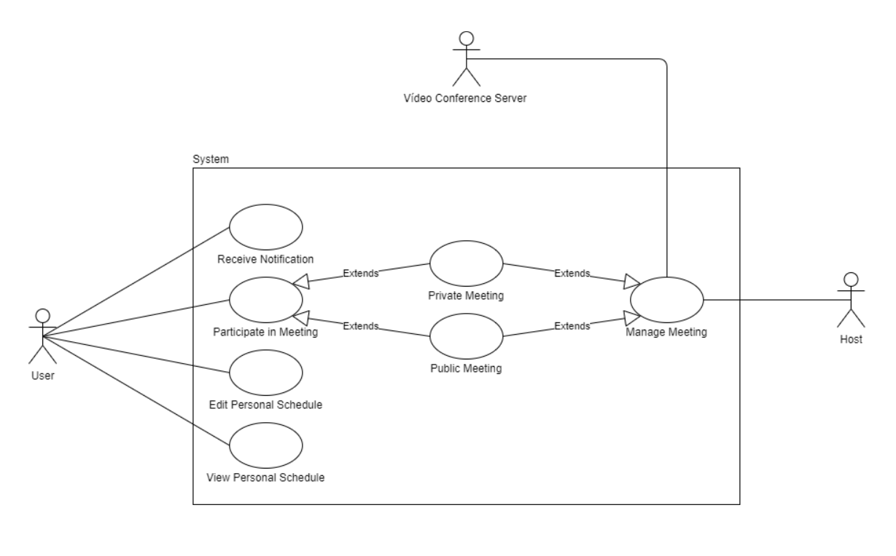

# openCX-Video Session Toolkit Development Report

Welcome to the documentation pages of the **Video Session Toolkit** of **openCX**!

You can find here detailed about the Video Session Toolkit, hereby mentioned as module, from a high-level vision to low-level implementation decisions, a kind of Software Development Report (see [template](https://github.com/softeng-feup/open-cx/blob/master/docs/templates/Development-Report.md)), organized by discipline (as of RUP): 

* Business modeling 
  * [Product Vision](#Product-Vision)
  * [Elevator Pitch](#Elevator-Pitch)
* Requirements
  * [Use Case Diagram](#Use-case-diagram)
  * [User stories](#User-stories)
  * [Domain model](#Domain-model)
* Architecture and Design
  * [Logical architecture](#Logical-architecture)
  * [Physical architecture](#Physical-architecture)
  * [Prototype](#Prototype)
* [Implementation](#Implementation)
* [Test](#Test)
* [Configuration and change management](#Configuration-and-change-management)
* [Project management](#Project-management)

So far, contributions are exclusively made by the initial team, but we hope to open them to the community, in all areas and topics: requirements, technologies, development, experimentation, testing, etc.

Please contact us! 

Thank you!

Developed with love by:  
Luís Silva up201808912@fe.up.pt  
Maria Baia up201704951@fe.up.pt
Pedro Azevedo up201806728@fe.up.pt
Pedro Pinto  up201806251@fe.up.pt

---

## Product Vision

<!--A product vision describes the essential of the product and sets the direction to where a product is headed, and what the product will deliver in the future. 

**We favor a catchy and concise statement, ideally one sentence.**

To learn more about how to write a good product vision, please see also:
* [How To Create A Convincing Product Vision To Guide Your Team, by uxstudioteam.com](https://uxstudioteam.com/ux-blog/product-vision/)
* [Product Management: Product Vision, by ProductPlan](https://www.productplan.com/glossary/product-vision/)
* [Vision, by scrumbook.org](http://scrumbook.org/value-stream/vision.html)
* [How to write a vision, by dummies.com](https://www.dummies.com/business/marketing/branding/how-to-write-vision-and-mission-statements-for-your-brand/)
* [20 Inspiring Vision Statement Examples (2019 Updated), by lifehack.org](https://www.lifehack.org/articles/work/20-sample-vision-statement-for-the-new-startup.html)
-->
---
## Elevator Pitch

Setting up a virtual meeting is arduous and boring and can be very repetitive and prone to human  errors if there are multiple sessions to be adjourned.  
It's time consuming for hosts and an organizational mess for attendees, who are bombarded with many different links and have to manage several different platforms getting confused in which one each meeting will occur.

Video Session Toolkit removes the anxiety from virtual sessions' management.  
Create meetings fast and easily, keep track of your sessions, join sessions easily and using a single app, create a gathering easily, comunicate changes with the audience instantly and much more.

---
## Requirements

In this section, you should describe all kinds of requirements for your module: functional and non-functional requirements.

Start by contextualizing your module, describing the main concepts, terms, roles, scope and boundaries of the application domain addressed by the project.

### Use case diagram 

#### **Authentication**

* **Actor:** User

* **Description:** Is the process by which users securely access the system, in order to use the application.

* **Preconditions and Postconditions:** There is no preconditions for a user to authenticate, however after authenticating the user can use all the tools of the application.

* **Normal Flow:**
  * On the main page of the application, the actor selects the option "Sign up" if he doesn't have an account.
  * The actor sees the "Sign up" page.
  * The actor fills the necessary spaces.
  * The actor must press de "Next" button to confirm authentication.

* **Alternative Flows and Exceptions:**
  * On the main page of the application, the actor selects the option "Log in" if he has an account.
  * The actor sees the "Log in" page.
  * The actor fills the necessary spaces.
  * The actor must press de "Next" button to confirm authentication.

#### **Participate in a Meeting**

* **Actor:** User

* **Description:** Each user can participate in a meeting, which can be
private or public.

* **Preconditions and Postconditions:** To participate in a meeting the user must be authenticated in the application. How ever, if it is a private meeting, the user must be invited to that meeting.

* **Normal Flow:** Provide a detailed description of the user actions and system responses that will take place during execution of the use case under normal, expected conditions. This dialog sequence will ultimately lead to accomplishing the goal stated in the use case name and description. This is best done as a numbered list of actions performed by the actor, alternating with responses provided by the system.

* **Alternative Flows and Exceptions:** Document other, legitimate usage scenarios that can take place within this use case, stating any differences in the sequence of steps that take place. In addition, describe any anticipated error conditions that could occur during execution of the use case, and define how the system is to respond to those conditions.

#### **Receive Notifications**

* **Actor:** User

* **Description:** The user can receive a notification to notify them of a future meeting.

* **Preconditions and Postconditions:** To receive notification the user must be authenticated in the application.

* **Normal Flow:** ???????????????????????????????

* **Alternative Flows and Exceptions:** ???????????????????????????????

#### **View Personal Schedule**

* **Actor:** User

* **Description:** The user can see his schedule of future meetings.

* **Preconditions and Postconditions:** To see the personal schedule, the user must be authenticated in the application.

* **Normal Flow:**
  * In the Menu, the actor selects de "Schedule" option.
  * The actor sees the "Schedule" page.

* **Alternative Flows and Exceptions:** ???????????????????????????????

#### **Edit Personal Schedule**

* **Actor:** User

* **Description:** The user can edit his schedule of future meetings, by adding an existing meeting to the schedule, or deleting a meeting from the schedule.

* **Preconditions and Postconditions:** To see the personal schedule, the user must be authenticated in the application.

* **Normal Flow:** ???????????????????????????????
  * In the "Menu" page, the actor selects the "Schedule" option.
  * The actor sees the "Schedule" page.
  * In the "Schedule" page, the actor selects the edit icon.
  * The actor sees the "Edit Schedule" page.
  * In the "Edit Schedule" page, the actor can select de button "Add Meeting" or "Edit Schedule".

* **Alternative Flows and Exceptions:** ???????????????????????????????

#### **Manage Meeting**

* **Actor:** Host

* **Description:** The host can create a meeting, and he can also edit or delete it.

* **Preconditions and Postconditions:** To manage a metting, the host must also be a user, and therefore must be authenticated in the application.

* **Normal Flow:** ???????????????????????????????
  * 
  * 

* **Alternative Flows and Exceptions:** ???????????????????????????????

#### **Private Meeting**

* **Actor:** ???????????????????????????????

* **Description:** ???????????????????????????????

* **Preconditions and Postconditions:** ???????????????????????????????

* **Normal Flow:** ??????????????????????????????? 

* **Alternative Flows and Exceptions:** ???????????????????????????????

#### **Public Meeting**

* **Actor:** ???????????????????????????????

* **Description:** ???????????????????????????????

* **Preconditions and Postconditions:** ???????????????????????????????

* **Normal Flow:** ???????????????????????????????

* **Alternative Flows and Exceptions:** ???????????????????????????????

### User stories
This section will contain the requirements of the product described as **user stories**, organized in a global **[user story map](https://plan.io/blog/user-story-mapping/)** with **user roles** or **themes**.

For each theme, or role, you may add a small description. User stories should be detailed in the tool you decided to use for project management (e.g. trello or github projects).

A user story is a description of desired functionality told from the perspective of the user or customer. A starting template for the description of a user story is 

*As a < user role >, I want < goal > so that < reason >.*

**INVEST in good user stories**. 
You may add more details after, but the shorter and complete, the better. In order to decide if the user story is good, please follow the [INVEST guidelines](https://xp123.com/articles/invest-in-good-stories-and-smart-tasks/).

**User interface mockups**.
After the user story text, you should add a draft of the corresponding user interfaces, a simple mockup or draft, if applicable.

**Acceptance tests**.
For each user story you should write also the acceptance tests (textually in Gherkin), i.e., a description of scenarios (situations) that will help to confirm that the system satisfies the requirements addressed by the user story.

**Value and effort**.
At the end, it is good to add a rough indication of the value of the user story to the customers (e.g. [MoSCoW](https://en.wikipedia.org/wiki/MoSCoW_method) method) and the team should add an estimation of the effort to implement it, for example, using t-shirt sizes (XS, S, M, L, XL).

#### Story #1
 * As a host, I want an interface to the product.

# Story2
 * As a host, I want to create a meeting.

### Domain model

To better understand the context of the software system, it is very useful to have a simple UML class diagram with all the key concepts (names, attributes) and relationships involved of the problem domain addressed by your module.

---

## Architecture and Design
The architecture of a software system encompasses the set of key decisions about its overall organization. 

A well written architecture document is brief but reduces the amount of time it takes new programmers to a project to understand the code to feel able to make modifications and enhancements.

To document the architecture requires describing the decomposition of the system in their parts (high-level components) and the key behaviors and collaborations between them. 

In this section you should start by briefly describing the overall components of the project and their interrelations. You should also describe how you solved typical problems you may have encountered, pointing to well-known architectural and design patterns, if applicable.

### Logical architecture
The purpose of this subsection is to document the high-level logical structure of the code, using a UML diagram with logical packages, without the worry of allocating to components, processes or machines.

It can be beneficial to present the system both in a horizontal or vertical decomposition:
* horizontal decomposition may define layers and implementation concepts, such as the user interface, business logic and concepts; 
* vertical decomposition can define a hierarchy of subsystems that cover all layers of implementation.

### Physical architecture
The goal of this subsection is to document the high-level physical structure of the software system (machines, connections, software components installed, and their dependencies) using UML deployment diagrams or component diagrams (separate or integrated), showing the physical structure of the system.

It should describe also the technologies considered and justify the selections made. Examples of technologies relevant for openCX are, for example, frameworks for mobile applications (Flutter vs ReactNative vs ...), languages to program with microbit, and communication with things (beacons, sensors, etc.).

### Prototype
To help on validating all the architectural, design and technological decisions made, we usually implement a vertical prototype, a thin vertical slice of the system.

In this subsection please describe in more detail which, and how, user(s) story(ies) were implemented.

---

## Implementation
Regular product increments are a good practice of product management. 

While not necessary, sometimes it might be useful to explain a few aspects of the code that have the greatest potential to confuse software engineers about how it works. Since the code should speak by itself, try to keep this section as short and simple as possible.

Use cross-links to the code repository and only embed real fragments of code when strictly needed, since they tend to become outdated very soon.

---
## Test

There are several ways of documenting testing activities, and quality assurance in general, being the most common: a strategy, a plan, test case specifications, and test checklists.

In this section it is only expected to include the following:
* test plan describing the list of features to be tested and the testing methods and tools;
* test case specifications to verify the functionalities, using unit tests and acceptance tests.
 
A good practice is to simplify this, avoiding repetitions, and automating the testing actions as much as possible.

---
## Configuration and change management

Configuration and change management are key activities to control change to, and maintain the integrity of, a project’s artifacts (code, models, documents).

For the purpose of ESOF, we will use a very simple approach, just to manage feature requests, bug fixes, and improvements, using GitHub issues and following the [GitHub flow](https://guides.github.com/introduction/flow/).

---

## Project management

Software project management is an art and science of planning and leading software projects, in which software projects are planned, implemented, monitored and controlled.

In the context of ESOF, we expect that each team adopts a project management tool capable of registering tasks, assign tasks to people, add estimations to tasks, monitor tasks progress, and therefore being able to track their projects.

Example of tools to do this are:
  * [Trello.com](https://trello.com)
  * [Github Projects](https://github.com/features/project-management/com)
  * [Pivotal Tracker](https://www.pivotaltracker.com)
  * [Jira](https://www.atlassian.com/software/jira)

We recommend to use the simplest tool that can possibly work for the team.

---

## Evolution - contributions to open-cx

Describe your contribution to open-cx (iteration 5), linking to the appropriate pull requests, issues, documentation.
