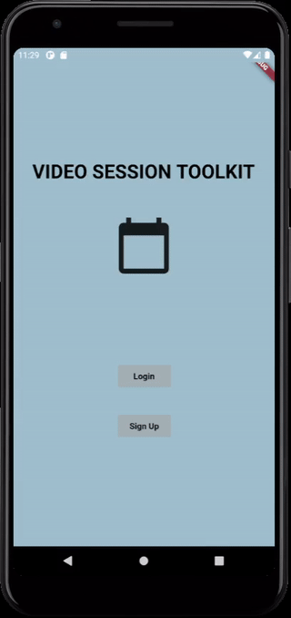

# openCX-Video Session Toolkit Development Report

Welcome to the documentation pages of the **Video Session Toolkit** of **openCX**!

You can find here detailed about the Video Session Toolkit, hereby mentioned as module, from a high-level vision to low-level implementation decisions, a kind of Software Development Report (see [template](https://github.com/softeng-feup/open-cx/blob/master/docs/templates/Development-Report.md)), organized by discipline (as of RUP): 

* Business modeling 
  * [Product Vision](#Product-Vision)
  * [Elevator Pitch](#Elevator-Pitch)
* Requirements
  * [Use Case Diagram](#Use-case-diagram)
  * [User stories](#User-stories)
  * [Domain model](#Domain-model)
* Architecture and Design
  * [Logical architecture](#Logical-architecture)
  * [Physical architecture](#Physical-architecture)
  * [Prototype](#Prototype)
* [Implementation](#Implementation)
* [Test](#Test)
* [Configuration and change management](#Configuration-and-change-management)
* [Project management](#Project-management)

So far, contributions are exclusively made by the initial team, but we hope to open them to the community, in all areas and topics: requirements, technologies, development, experimentation, testing, etc.

Please contact us! 

Thank you!

Developed with love by:  
Luís Silva up201808912@fe.up.pt  
Maria Baia up201704951@fe.up.pt  
Pedro Azevedo up201806728@fe.up.pt  
Pedro Pinto  up201806251@fe.up.pt

---

## Product Vision

Making virtual connections easy!

<!--A product vision describes the essential of the product and sets the direction to where a product is headed, and what the product will deliver in the future. 

Making virtual connections easy!
Simplify meetups!
Video meetups for all!

**We favor a catchy and concise statement, ideally one sentence.**

To learn more about how to write a good product vision, please see also:
* [How To Create A Convincing Product Vision To Guide Your Team, by uxstudioteam.com](https://uxstudioteam.com/ux-blog/product-vision/)
* [Product Management: Product Vision, by ProductPlan](https://www.productplan.com/glossary/product-vision/)
* [Vision, by scrumbook.org](http://scrumbook.org/value-stream/vision.html)
* [How to write a vision, by dummies.com](https://www.dummies.com/business/marketing/branding/how-to-write-vision-and-mission-statements-for-your-brand/)
* [20 Inspiring Vision Statement Examples (2019 Updated), by lifehack.org](https://www.lifehack.org/articles/work/20-sample-vision-statement-for-the-new-startup.html)
-->

---

## Elevator Pitch

<!--Setting up a virtual meeting is arduous and boring and can be very repetitive and prone to human  errors if there are multiple sessions to be adjourned.  
It's time consuming for hosts and an organizational mess for attendees, who are bombarded with many different links and have to manage several different platforms getting confused in which one each meeting will occur.-->

Video Session Toolkit removes the anxiety from virtual sessions' management.  
Create meetings fast and easily, keep track of your sessions, join sessions easily and using a single app, create a gathering easily, comunicate changes with the audience instantly and much more.

---

## Pre-Requirements

For the usage of the module it is required that the user has a mobile phone with internet connection. It is required to have an account in the application.  
For full funtionality it is reccommended to have notifications enabled.  
Android version=>8.0  
Ios version>=Ios 10.0.0  

---

## Requirements

With Video Session Toolkit participating in interesting sessions at a conference or setting virtual encounters with other participants is easy and practical. With its calendar and video apps integration, there is no hassle in setting up a virtual room or in finding the correct session link. Additionally, a reminder before any meeting will help to be right on time, everytime.

<!--Start by contextualizing your module, describing the main concepts, terms, roles, scope and boundaries of the application domain addressed by the project.-->

### Use case diagram


#### **Participate in a Meeting/Session**

* **Actor:** User

* **Description:** Each user can participate in a meeting which can be private or public.

* **Preconditions and Postconditions:** To participate in a meeting the user must be authenticated in the application. However, if it is a private meeting, the user must be invited to that meeting.

* **Normal Flow:** 
  
  * In the "Schedule" page, the user selects the meeting link to attend.

* **Alternative Flows and Exceptions::**
  
  * In the "Menu" page, the actor selects the "Schedule" page.
  * In the "Schedule" page, the actor selects the meeting link to attend.

#### **Receive Notifications**

* **Actor:** User

* **Description:** The user can receive a notification to remind them of a future meeting.

* **Preconditions and Postconditions:** To receive notification the user must be authenticated in the application, and have the app notifications active.

* **Normal Flow:** A Notification is shown to the user when a meeting in the user calendar is about to start.

#### **View Personal Schedule**

* **Actor:** User

* **Description:** The user can see his schedule of future meetings.

* **Preconditions and Postconditions:** To see the personal schedule, the user must be authenticated in the application.

* **Normal Flow:**
  
  * In the Menu, the actor selects de "Schedule" option.
  * The actor sees the "Schedule" page.

#### **Edit Personal Schedule**

* **Actor:** User

* **Description:** The user can edit his schedule of future meetings, by adding an existing meeting to the schedule, or deleting a meeting from the schedule.

* **Preconditions and Postconditions:** To see the personal schedule, the user must be authenticated in the application.

* **Normal Flow:**
  
  * In the "Menu" page, the actor selects the "Schedule" option.
  * The actor sees the "Schedule" page.
  * The actor selects the edit icon.
  * The actor sees the "Edit Schedule" page.
  * The actor can select the "Add Meeting" button.
  * The actor sees the "Add Meeting" page.
  * The actor selects desired meeting to add and presses the "Next" button to confirm.

* **Normal Flow:**
  
  * In the "Menu" page, the actor selects the "Schedule" option.
  * The actor sees the "Schedule" page.
  * The actor selects the edit icon.
  * The actor sees the "Edit Schedule" page.
  * The actor can select the "Remove Meeting" button.
  * The actor sees the "Remove Meeting" page.
  * The actor selects the meetings to remove and presses the "Next" button to confirm.

* **Alternative Flow:**
  
  * In the "Edit Schedule" page, the actor presses the "Cancel" to return to the previous page.

* **Alternative Flow:**
  
  * In the "Remove Meeting" page, the actor presses the "Cancel" to return to the previous page.

* **Alternative Flow:**
  
  * In the "Add Meeting" page, the actor presses the "Cancel" to return to the previous page.

#### **Manage Meeting**

* **Actor:** Host

* **Description:** The host can create a meeting, and he can also edit or delete it.

* **Preconditions and Postconditions:** To manage a metting, the host must also be a user, and therefore must be authenticated in the application.

* **Normal Flow:** 
  
  * In the "Menu" page, the actor selects the "Create Meeting" option.
  * The actor sees the "Create Meeting" page.
  * The actor fills the necessary spaces.
  * The actor must press de "Next" button to confirm authentication.

* **Normal Flow:** 
  
  * In the "Menu" page, the actor selects the "Profile" option.
  * The actor sees the "Profile" page.
  * The actor selects the edit icon.
  * The actor sees the "Edit Profile" page.
  * The actor selects the meeting to edit.
  * The actor changes the necessary spaces.  
  * The actor must press de "Next" button to confirm.

* **Normal Flow:** 
  
  * In the "Menu" page, the actor selects the "Profile" option.
  * The actor sees the "Profile" page.
  * The actor selects the edit icon.
  * The actor sees the "Edit Profile" page.
  * The actor selects the meeting to edit.
  * The actor must press de "Delete Meeting" button to delete the meeting.

* **Alternative Flows**
  
  * In the "Create Meeting" page, the actor presses the "Cancel" to return to the previous page.

* **Alternative Flows**
  
  * In the "Edit Profile" page, the actor presses the "Cancel" to return to the previous page.

* **Alternative Flows**
  
  * In the "Edit Meeting" page, the actor presses the "Cancel" to return to the previous page.

#### **Private Meeting**

* **Actor:** Actor and Host

* **Description:** Its a specific type of meetings to be handled.

* **Preconditions and Postconditions:** To access the private meeting, the user must be authenticated in the application, so that he can access a private meeting as a user, only if he is invited to do so, or create a private meeting as a host.

#### **Public Meeting**

* **Actor:** Actor and Host

* **Description:** Its a specific type of meetings to be handled.

* **Preconditions and Postconditions:** To access the public meeting, the user must be authenticated in the application, so that he can access a public meeting as a user, or create a public meeting as a host.

### User stories

<!--This section will contain the requirements of the product described as **user stories**, organized in a global **[user story map](https://plan.io/blog/user-story-mapping/)** with **user roles** or **themes**.

For each theme, or role, you may add a small description. User stories should be detailed in the tool you decided to use for project management (e.g. trello or github projects).

A user story is a description of desired functionality told from the perspective of the user or customer. A starting template for the description of a user story is 

*As a < user role >, I want < goal > so that < reason >.*

**INVEST in good user stories**. 
You may add more details after, but the shorter and complete, the better. In order to decide if the user story is good, please follow the [INVEST guidelines](https://xp123.com/articles/invest-in-good-stories-and-smart-tasks/).

**User interface mockups**.
After the user story text, you should add a draft of the corresponding user interfaces, a simple mockup or draft, if applicable.

**Acceptance tests**.
For each user story you should write also the acceptance tests (textually in Gherkin), i.e., a description of scenarios (situations) that will help to confirm that the system satisfies the requirements addressed by the user story.

**Value and effort**.
At the end, it is good to add a rough indication of the value of the user story to the customers (e.g. [MoSCoW](https://en.wikipedia.org/wiki/MoSCoW_method) method) and the team should add an estimation of the effort to implement it, for example, using t-shirt sizes (XS, S, M, L, XL).-->

#### User story map


#### **Story** #1

* ***User Storie:*** As a host, I want an interface to the product.

* ***Value:*** Must Have.

* ***Effort:*** XL

* ##### ***Acceptance tests:***
  
  ```Gherkin
  Scenario: Switching pages  
  When I press the next button
  Then a page other than the previous or actual page is shown.
  ```

* ***Interface mockups:***
  
  
    

[See all mockups](./Prototype%20Design)

#### **Story** #2

* ***User Storie:*** As a host, I want to create a meeting.

* ***Value:*** Must Have.

* ***Effort:*** L

* ##### ***Acceptance tests:***
  
  ```Gherkin
  Scenario: Creating a meeting page  
  When I fill-in all the boxes
  And I press the "next" button
  Then a new meeting is created And added to a list of existing meetings And is visible in the calendar.
  ```
  
  ```Gherkin
  Scenario: Creating a meeting page  
     When I fill-in all the boxes
   And set the meetings date to a previous time
   And I press the "next" button
     Then fails to create a new meeting
   And a red line is shown to the user indicating the wrong field.
  ```

* ***Interface mockups:*** 
  
  

#### **Story** #3

* ***User Storie:*** As a host, I want to manage my schedule.

* ***Value:*** Must Have.

* ***Effort:*** XL

* ##### ***Acceptance tests:***
  
  | Given                                                 | When                                          | Then                                                        |
  | ----------------------------------------------------- | --------------------------------------------- | ----------------------------------------------------------- |
  | The page to add a meeting to the personal schedule    | User selects a meeting from existing meetings | A new meeting is added to his personal schedule             |
  | The page to view a meeting from the personal schedule | User selects the button to delete the meeting | That meeting will no longer appear on the personal calendar |

* ***Interface mockups:***


#### **Story** #4

* ***User Storie:*** As a host, I want a permenant record of meetings.

* ***Value:*** Must Have.

* ***Effort:*** L

* ##### ***Acceptance tests:***
  
  | Given                        | When                                       | Then                                                      |
  | ---------------------------- | ------------------------------------------ | --------------------------------------------------------- |
  | The page to create a meeting | User finalizes the creation of the meeting | A new meeting is created with a unique id.                |
  | The page to create a meeting | User finalizes the creation of the meeting | The meeting is added to a list of meetings                |
  | The page to create a meeting | User finalizes the creation of the meeting | The meeting is added to the personal schedule of the host |

### Domain model

The video Session Toolkit intends to help organize a users schedule and conference links.

* Each session has a start date and hour and a finishing hour. It has a title, a video-chat platform, a room link and can either be public (part of the conference) or private (between people attending).
* The calendar olds the sessions.
* Each user has a profile which olds information about the sessions he'll attend as well as the sessions created with other users (private sessions).


---

## Architecture and Design

The program follows an MVC approach. The database and its querys are independent of its design and of the rendering. The screens translate into different states of the application and the screen buttons are widgets that redirect application to other states. All querys to the database are asyncronous.

### Logical architecture

Following the MVC approach, we were able to highlight three different components:

- *Model*: that consists of the logical part of the application, that stores and manages the application data.

- *Controller*: this converts actions made by the user to demands to retrieve/update data in the storage/model.

- *View*: represents the visual representation of our application showing the respective data and being manipulated by the controller.

 

### Physical architecture

The physical architecture of our project is divided into two parts, which are connected to each other.
The Video Talk Toolkit app must be installed on the user's smartphone, and it will connect with the database via HTTPS request to sync user's profile changes and update local information.
The technologies used in this project were Flutter-Dart as the framework for our mobile application, Graddle for build automation and Firebase server for storage.


<!--The goal of this subsection is to document the high-level physical structure of the software system (machines, connections, software components installed, and their dependencies) using UML deployment diagrams or component diagrams (separate or integrated), showing the physical structure of the system.

It should describe also the technologies considered and justify the selections made. Examples of technologies relevant for openCX are, for example, frameworks for mobile applications (Flutter vs ReactNative vs ...), languages to program with microbit, and communication with things (beacons, sensors, etc.).-->

### Prototype
  

This prototype reflects some of the major user stories:  

* The login page

* The profile page

* The calendar

* Adding, removing, creating and editting events

* Private and public sessions/meetings  

* Ability to choose the paltform for the meeting

* And the overall usage flow  


<!--To help on validating all the architectural, design and technological decisions made, we usually implement a vertical prototype, a thin vertical slice of the system.

In this subsection please describe in more detail which, and how, user(s) story(ies) were implemented. -->

---

## Implementation

All releases can be found in the [Releases page](https://github.com/FEUP-ESOF-2020-21/open-cx-t1g5-esoflers/releases).

---

## Test

The features that require testing are the following:

* [Create a session](#acceptance-tests-1)
* [Add a session to calendar](#acceptance-tests-2)
* [Verify app routes throughout the different screens](#acceptance-tests)

<!-- There are several ways of documenting testing activities, and quality assurance in general, being the most common: a strategy, a plan, test case specifications, and test checklists.

In this section it is only expected to include the following:

* test plan describing the list of features to be tested and the testing methods and tools;
* test case specifications to verify the functionalities, using unit tests and acceptance tests.

A good practice is to simplify this, avoiding repetitions, and automating the testing actions as much as possible. -->

---

## Configuration and change management

The project flow was controlled using github. The github flow was followed having, therefore, a development branch, where the features branches are merged and a master branch where releases are made.

---

## Project management

In order to manage the project's progress, tasks and team, github projects was used. The board can be found [here](https://github.com/FEUP-ESOF-2020-21/open-cx-t1g5-esoflers/projects/1).

<!--Software project management is an art and science of planning and leading software projects, in which software projects are planned, implemented, monitored and controlled.

In the context of ESOF, we expect that each team adopts a project management tool capable of registering tasks, assign tasks to people, add estimations to tasks, monitor tasks progress, and therefore being able to track their projects.

Example of tools to do this are:

* [Trello.com](https://trello.com)
* [Github Projects](https://github.com/features/project-management/com)
* [Pivotal Tracker](https://www.pivotaltracker.com)
* [Jira](https://www.atlassian.com/software/jira)

We recommend to use the simplest tool that can possibly work for the team.-->

---

<!--## Evolution - contributions to open-cx

Describe your contribution to open-cx (iteration 5), linking to the appropriate pull requests, issues, documentation.-->
